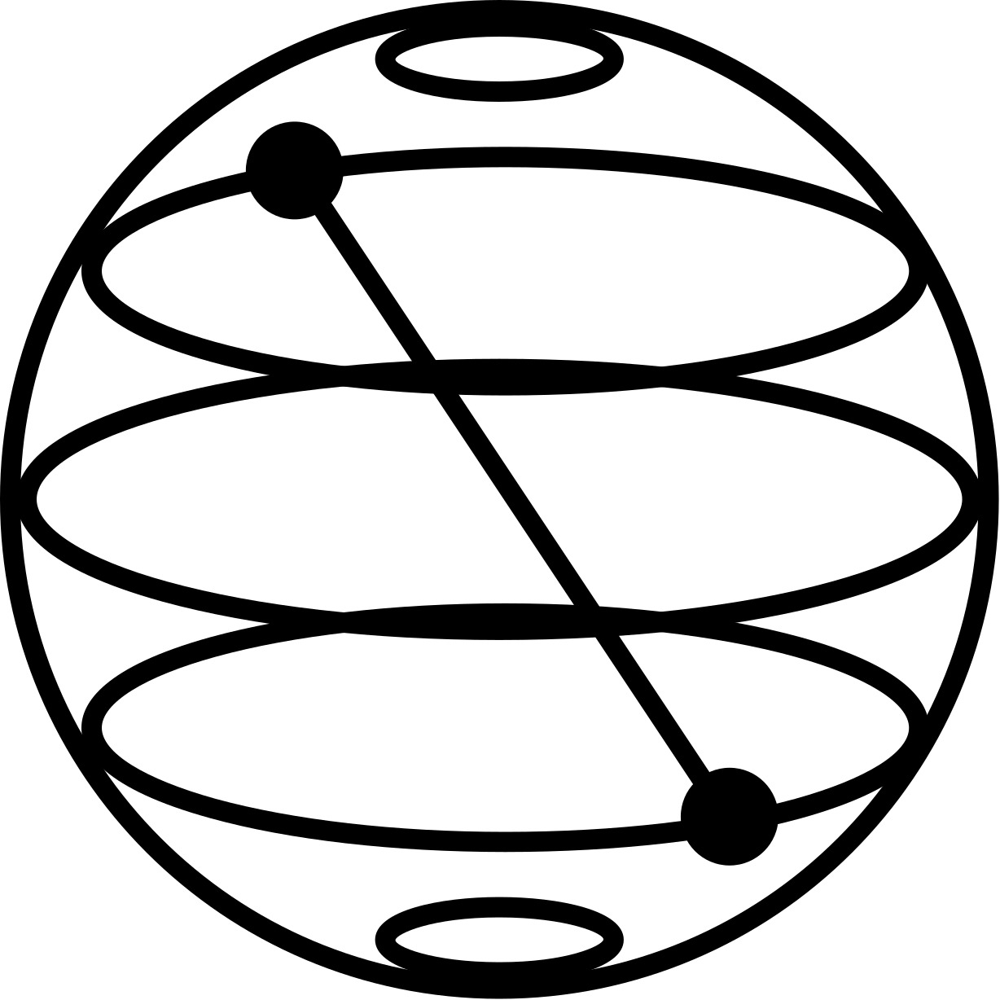

# Hello World 👋, I'm Sahaj Raj Malla - aka [S.T.E.M. Geek]  

## I'm a Mathematician, Programmer and Researcher.

 

- 🔭 I’m currently learning Computational Complexity and Quantum Computation 🧠
- 👯 I’m looking to collaborate with other in Scientific Research Papers Writing.
- 🥅 2022 Goals: Publish a great Research Paper.
- ⚡ Fun fact: I love to play violin , football and learn new stuffs. 

---

### 🔗 &nbsp;&nbsp; Connect with me:
 

&nbsp;&nbsp;

---
 

## *My Techstack:*

### **Mathematics**

- Linear Algebra
- Complex Number
- Calculus
- Statistics
- Probability

### **Web Application Development**

- #### *Frontend Tools*

 
 

- #### *Backend Tools*

 
 

- #### *Database*

 
 

### **Data Science**

 
 

### **Cloud Computing**

 
 

### **Quantum Computing**

 
 

### **Management Tools**

 
 

### **Operating System**

 
 

---

